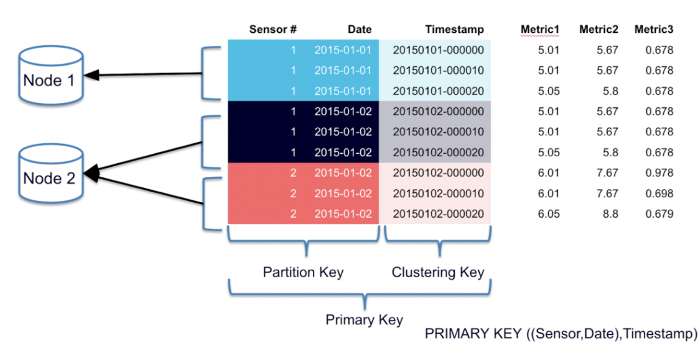
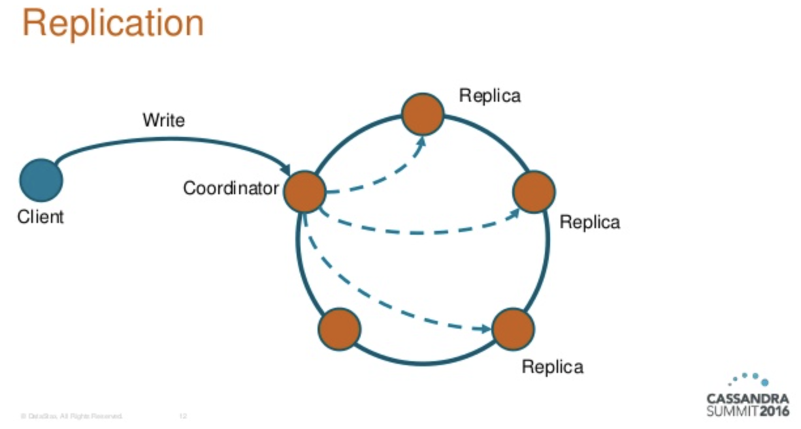
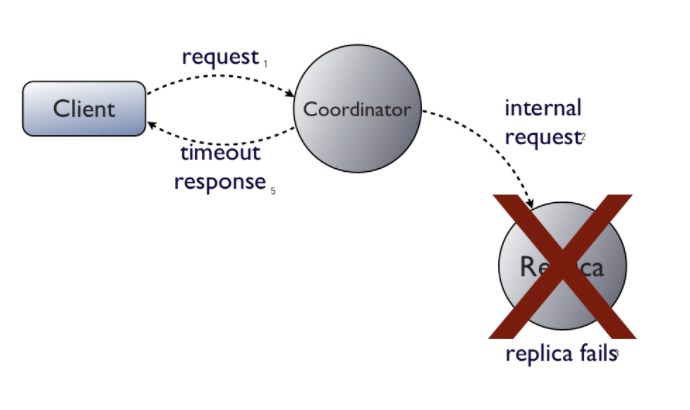
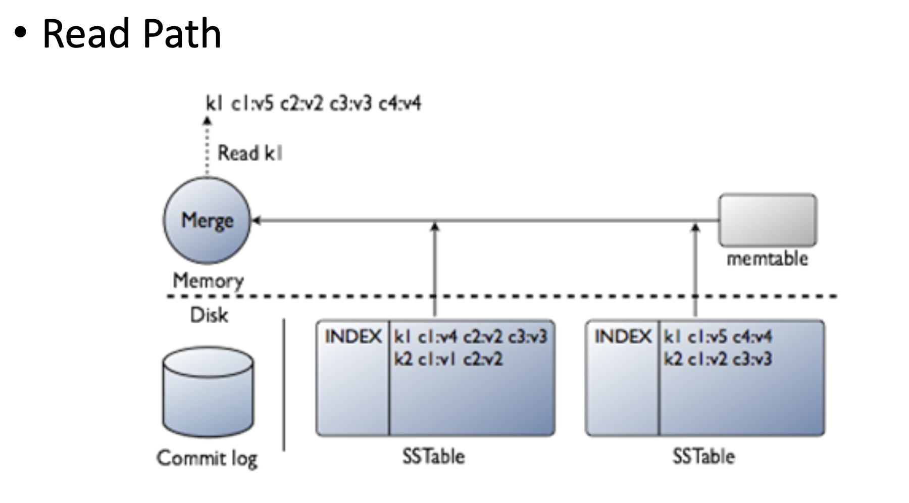
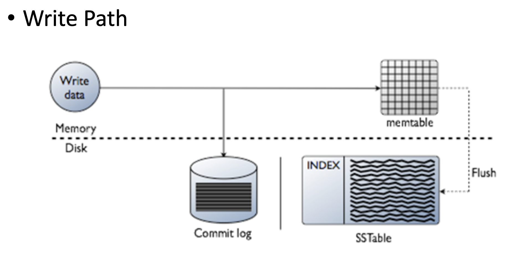

# What is Cassandra?
Apache Cassandra is an open source NoSQL distributed database trusted by thousands of companies for scalability and high availability without compromising performance. Linear scalability and proven fault-tolerance on commodity hardware or cloud infrastructure make it the perfect platform for mission-critical data.

# Why Cassandra?
Facebook's platform has stringent operating requirements in terms of performance, reliability, and efficiency, and it must be extremely scalable to accommodate further expansion. Our regular mode of operation involves dealing with failures in an infrastructure made of thousands of components; there are always a small but considerable number of server and network components that are failing at any one moment.

# Data Model
In Cassandra, a table is a distributed multi-dimensional map that is indexed by a key. The value consists of a highly organized item. In a table, the row key is a string that has no size constraints but is commonly 16 to 36 bytes long.
## Rows
Every
operation under a single row key is atomic per replica no
matter how many columns are being read or written into

## Columns
Similar to how the Bigtable system does it, columns are grouped together into groupings called column families. Simple and Super column families are the two types of column families that Cassandra exposes. As a column family within a column family, super column families may be seen.

# Cassandra API
The Cassandra API consists of the following three simple
methods.
* insert(table, key, rowMutation)
* get(table, key, columnName)
* delete(table, key, columnName)

# Cassandra Architecture
A storage system that must work in a production environment has a complicated architecture. The system must have scalable and robust solutions for load balancing, membership and failure detection, failure recovery, replica synchronization, overload handling, state transfer, concurrency and job scheduling, request marshalling, request routing, system monitoring and alarming, and configuration management, in addition to the actual data persistence component.
##  Partitioning
Cassandra's capacity to expand progressively is one of its fundamental architectural advantages. This necessitates the capacity to dynamically split data among the cluster's nodes.
Data partitioning is performed using a partitioning algorithm which is configured at the cluster level while the partition key is configured at the table level. 

 Cassandra partitions data across the
cluster using consistent hashing but uses an order preserving hash function to do so.

## Replication
Cassandra achieves high availability and durability through replication. Each data item is duplicated on N hosts, with N 36 being the “per-instance” replication factor. A coordinator node is given to each key, k. (described in the previous section). The coordinator is in charge of replicating the data items within his or her range. The coordinator not only stores each key within its range locally, but also replicates them at the N-1 nodes in the ring.

##  Failure Detection
Failure detection is a mechanism by which a node can locally
determine if any other node in the system is up or down. In
Cassandra failure detection is also used to avoid attempts
to communicate with unreachable nodes during various operations. 

## Bootstrapping
When a node initially starts, it selects a random token to represent its location in the ring. The mapping is persisted to disk locally and in Zookeeper for fault tolerance.
After that, the token information is sent around the cluster.
This is how we know about all of the nodes in the ring and their relative locations. This allows any node in the cluster to redirect a key request to the proper node. When a node wants to join a cluster in the bootstrap scenario, it reads its configuration file, which comprises a list of a few contact points inside the cluster. These initial contact locations are referred to as cluster seeds. Seeds can also be obtained using a setup service such as Zookeeper.

## Scaling the Cluster
When a new node is introduced to the system, it is given a token that allows it to relieve the pressure on an overburdened node.
As a result, the new node splits a range that was previously handled by another node. An operator can start the Cassandra bootstrap procedure from any other node in the system by utilizing a command line utility.

## Local Persistence

For data durability, the Cassandra system uses the local file system. The information is stored on disk in a manner that allows for quick data retrieval. A typical write operation involves writing to a commit log for durability and recovery, as well as updating an in-memory data structure. Only after a successful writing into the commit log is the write into the in-memory data structure executed.
We have a separate drive for the commit log on each machine since all commit log writes are sequential and we want to maximize disk throughput.
The in-memory data structure dumps itself to disk when it reaches a specific threshold, which is computed depending on data size and number of objects.
This write is done on one of the numerous commodity drives that come standard with computers. All writes to disk are sequential, and an index is created based on the row key for efficient lookup.

